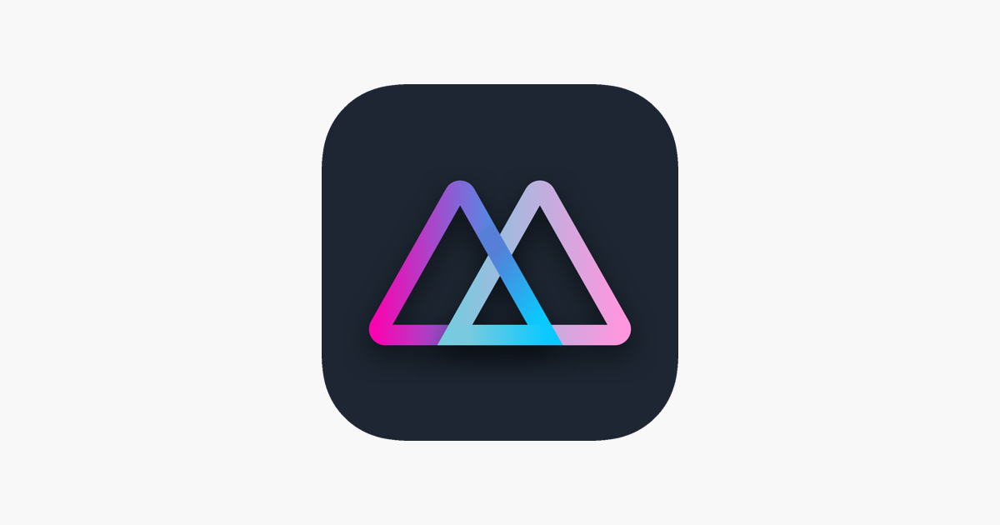

# MOZE Trend Visualizer

A containerized **R Shiny** app to visualize expense trends from data exported by the MOZE accounting mobile app. MOZE itself does not provide built-in trend charts, so this tool helps you track how the cost of a specific category (or sub-category) changes over time—for example, how your “lunch” expenses evolve month by month.

---

## Prerequisites

- **Docker** (make sure you have Docker installed on your machine)

---

## Installation

**Pull the Docker image** from Docker Hub:

```
### pull from my dockerhub
docker pull jordan841220/moze_trend:20250522
### run the container
docker container run -d --rm -p 3838:3838 jordan841220/moze_trend:20250522
```

## Usage
1. Once the container is up and running, open your browser and navigate to: http://localhost:3838/moze-expense-app/
2. Prepare your data file:
- MOZE can only export CSV, but this Shiny app expects a .txt file.
- Option A: Export a CSV from MOZE, then rename it to have a .txt extension.
- if you encounter encoding issues:
    - Export as CSV.
    - Open it in a text editor (e.g., VS Code) and save/convert it to UTF-8 encoding.
    - Rename the UTF-8 CSV file to .txt.
3. Upload the resulting .txt file via the Shiny interface.
4. The app will parse your MOZE expenses and display trend charts for any category or sub-category you select.
5. Since MOZE may include transactions in different currencies, you’ll need to enter your API key for https://api.exchangerate.host/convert to perform currency conversions.


## Notes
The app assumes that each line in your renamed .txt file follows MOZE’s standard export format (date, category, sub-category, amount, etc.).


